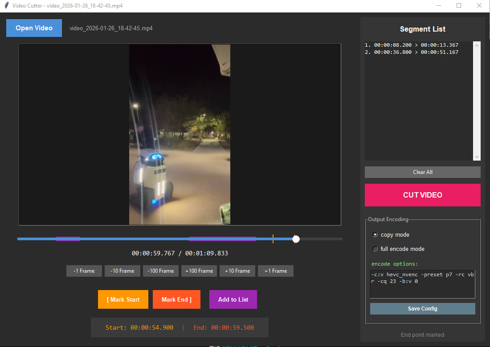

# Video Cutter



A desktop GUI application for precise video cutting and optional re-encoding, built with **Python**, **Tkinter**, **OpenCV**, and **FFmpeg**.

The application allows you to visually navigate through a video frame-by-frame, mark multiple segments, reorder or remove them, and export the result either **without re-encoding (stream copy)** or with **full re-encoding** (e.g. to MP4 / H.264 / HEVC).

---

## Key Idea

This tool is designed for situations where:

* You need **frame-accurate cutting**
* You want to extract **multiple segments** from a single video
* You want to **concatenate segments in a chosen order**
* You want control over whether the video is **copied losslessly** or **fully re-encoded**

FFmpeg is used for all actual media processing; the application provides a convenient visual interface on top of it.

---

## Features

* 🎞️ Open and preview common video formats (`mp4`, `avi`, `mkv`, `mov`, `wmv`, `webm`, etc.)
* ⏱️ Frame-accurate navigation:

  * Step by ±1 / ±10 / ±100 frames
  * Visual timeline slider
* ✂️ Segment-based cutting:

  * Mark **start** and **end** points
  * Add multiple segments
  * Reorder segments (up/down)
  * Delete individual segments or clear all
* 🧩 Visual timeline:

  * Highlighted segments
  * Start/end markers
* 📦 Two output modes:

### Copy mode (default)

* Uses `-c copy`
* No re-encoding
* Maximum speed
* No quality loss
* Output container matches input container

### Full re-encode mode

* Re-encodes video and audio using user-defined FFmpeg options

* Output container is always **MP4**

* Suitable for:

  * Changing codec
  * Normalizing formats
  * Hardware encoding (NVENC)

* ⚙️ Custom FFmpeg encoding options (editable and saved to config)

* 💾 Persistent configuration via `config.ini`

* 🧾 Full FFmpeg console output:

  * Separate FFmpeg console window (Windows)
  * Complete log saved to `ffmpeg.log`

---

## Requirements

### System

* Windows (tested on Windows 10 / 11)
* FFmpeg binary available

### Python

* Python **3.9+** recommended

### Python Libraries

Install required dependencies:

```bash
pip install opencv-python pillow
```

(Standard library modules such as `tkinter`, `threading`, `subprocess`, etc. are included with Python.)

---

## FFmpeg Setup

### Option 1: Local FFmpeg (recommended)

Place `ffmpeg.exe` **in the same directory** as the Python script.

### Option 2: System-wide FFmpeg

Install FFmpeg and ensure it is available in `PATH`:

```bash
ffmpeg -version
```

If FFmpeg is found in `PATH`, the application will use it automatically.

---

## How to Run

```bash
python main.py
```

(or whatever the main script file is named)

The GUI window will open immediately.

---

## Basic Workflow

1. Click **Open Video** and select a video file
2. Navigate to the desired start frame
3. Click **Mark Start**
4. Navigate to the desired end frame
5. Click **Mark End**
6. Click **Add to List**
7. Repeat for additional segments
8. (Optional) Reorder or delete segments
9. Choose output encoding mode:

   * `copy mode` for fast, lossless cutting
   * `full encode mode` for re-encoding
10. Click **CUT VIDEO**

The resulting file will be saved next to the original video with `_cut` added to the filename.

---

## Configuration

Encoding settings are stored in `config.ini` in the script directory.

Example:

```ini
[Encoding]
mode = reencode
reencode_options = -c:v libx264 -preset ultrafast -crf 18
```

These settings are automatically loaded on startup.

---

## Logging

* All FFmpeg output is written to:

```text
ffmpeg.log
```

* The log file is **overwritten on each run**
* A separate FFmpeg console window is opened during processing (Windows)

---

## Notes & Limitations

* Audio is always included if present
* Subtitle streams are currently ignored
* Very short segments may not be frame-perfect in copy mode due to container limitations
* FFmpeg determines final stream compatibility during concatenation

---

## License

This project is provided as-is for personal and educational use.

You are free to modify and adapt it for your own needs.

---

## Credits

* FFmpeg — [https://ffmpeg.org/](https://ffmpeg.org/)
* OpenCV — [https://opencv.org/](https://opencv.org/)
* Tkinter — Python standard GUI toolkit

